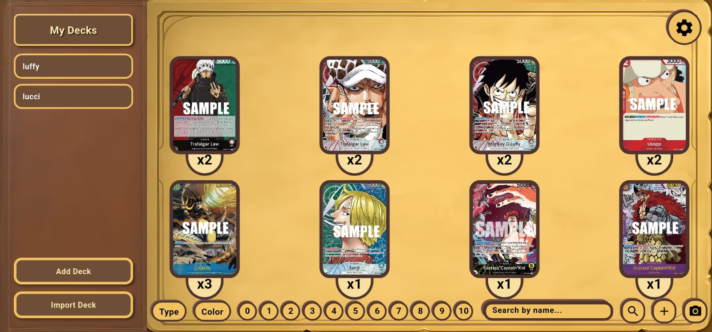

# One Piece Card Manager

A **Flutter + FastAPI** app for scanning, collecting, and managing **One Piece TCG cards**.

---

## Technologies
- **Frontend:** Flutter (Android + Windows desktop)
- **Backend:** FastAPI (Python)
- **Database:** PostgreSQL with SQLAlchemy ORM
- **AI Model:** YOLOv8 for real-time card detection

---

## How it looks

### Windows

### Android

---

## Features

- **Main Page**  
  Displays your collection of cards with search and filtering options.

- **Deck Tracker**  
  A sidebar on the left where you can build and manage your decks.

- **Filters & Search Bar**  
  Located at the bottom, allowing you to quickly find cards by name, ID, color, or type.

- **Card Scanning (Android)**  
  On Android devices, a floating button opens the **live scan page**.  
  You can scan cards using your camera and add them directly to your collection.  

  

